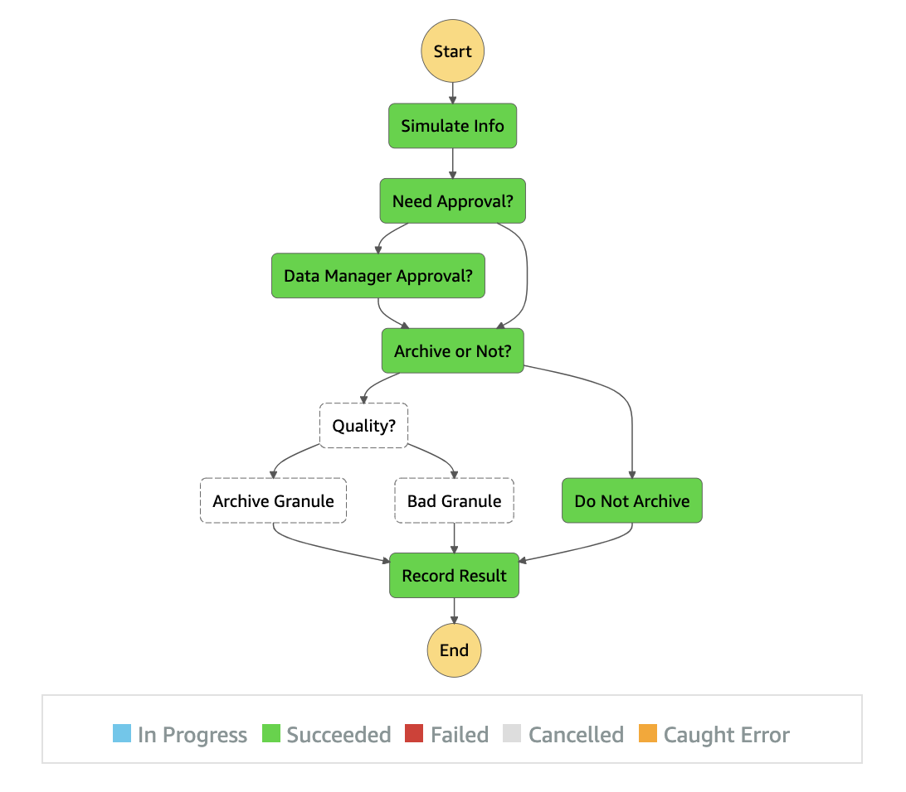

# overview

<p align="center">
  
</p>

key points
- most info less about SAM, more about step functions or cloudformation
- SAM is mostly just cloudformation + step functions + lambdas...

The GOOD</br>
[NRSAM = not really SAM feature, e.g. step functions]
- [NRSAM] AMAZING graph inspector (AWS->Step Functions->StateMachines)
- offers change config management to services
- sometimes just deploys changes to config
- [NRSAM] Statefunctions: Offers variable mapping incoming and outgoing

The Bad
- stack config errors often appear in deploy (not verification)
- slow deploy (maybe use localstack or "step functions local")
- not sure how to test StateMachine operators (localstack? lambdas testable in js/python/...)
- autogenerated tables clear every deploy? (hardcode in prod)
- autogenerated stack name clears every deploy? (hardcode in prod)

The Meh
- really cloudformation under hood
- example uses AWS Serverless vs direct State Machine

TODO
- Express workflows?

refs
- SAM: https://docs.aws.amazon.com/serverless-application-model/latest/developerguide/sam-resource-statemachine.html
- Step Functions: States: https://docs.aws.amazon.com/step-functions/latest/dg/concepts-states.html
- Step Functions: https://aws-step-functions-data-science-sdk.readthedocs.io/en/stable/steps.html
- Manipulate message en-route: https://docs.aws.amazon.com/step-functions/latest/dg/input-output-inputpath-params.html

# using

## basics
```
sam build
sam deploy
# OR
sam deploy --guided
```
setup vars for interaction
```
tn=`aws dynamodb list-tables | jq -r '.TableNames|.[]|select(match(".*ArchiveTable.*"))'|head -1`
sf=`aws stepfunctions list-state-machines | jq -r '.stateMachines|.[]|select(.stateMachineArn|match(".*ArchiverStateMachine.*"))|.stateMachineArn'`
echo $tn
echo $sf
qu=`aws sqs list-queues | jq -r '.QueueUrls|.[]' | head -1`
echo $qu
```
(optional) delete table docs if necessary
```
aws dynamodb scan --table-name "$tn" --max-items 1000 | tee moo.records   
cat moo.records | jq -r '.Items[].Id.S' \
    | xargs -I keyItem aws dynamodb delete-item --table-name "$tn" --key='{"Id":{"S":"keyItem"}}'
```
```
aws dynamodb scan --table-name $tn
```

## run (normal pre human interaction [neanderthal])
```
aws stepfunctions start-execution --state-machine-arn $sf
seq 10 | xargs -I moo aws stepfunctions start-execution --state-machine-arn $sf
```
```
aws dynamodb scan --table-name $tn \
    | jq -r '.Items|.[]|(.Timestamp.S+"\t"+(.Archive.BOOL|tostring)+"\t"+.Quality.N+"\t"+.Action.S+"\t"+(.Approval.BOOL|tostring))'
# timestamp archive quality result approval
2021-04-20T06:16:14.455Z        true    4       Quality_Fail
2021-04-20T06:16:19.193842      false   56      Unarchivable
2021-04-20T06:15:52.132594      false   9       Unarchivable
2021-04-20T06:16:17.852Z        true    96      Archived
2021-04-20T06:16:14.906734      false   60      Unarchivable

```
see (CloudWatch -> Logs -> Log groups) for events on statefunctions, lambdas, ?

## cool ui

debugging stepfunctions and lambdas in AWS console is amazing

- AWS -> Step Functions -> State Machines -> [machine] -> [exectution]
- AWS -> Cloud Watch -> Lambda
- AWS -> Lambda -> Functions -> [function] -> Monitor


## manual/human interaction
kick off (does not use response here)
```
aws stepfunctions start-execution --state-machine-arn $sf --input '{"approval_needed":true}'
```
get token and message handle
```
aws sqs receive-message --queue-url $qu | tee moo.sqs.msg
tt=`cat moo.sqs.msg| jq -r '.Messages[0].Body' | jq -r '.TaskToken'`
echo $tt
rh=`cat moo.sqs.msg| jq -r '.Messages[0].ReceiptHandle'`
echo $rh
```
manually send success callback
```
aws stepfunctions send-task-success --task-token "$tt" --task-output '{"approved":false}'
# OR
# aws stepfunctions send-task-success --task-token "$tt" --task-output '{"approved":true}'
aws sqs delete-message --queue-url $qu --receipt-handle
```

## optionally delete existing records
sometimes on SAM changes new table not generated
```
aws dynamodb scan --table-name "$tn" --max-items 1000 | tee moo.records   
cat moo.records | jq -r '.Items[].Id.S' \
    | xargs -I keyItem aws dynamodb delete-item --table-name "$tn" --key='{"Id":{"S":"keyItem"}}'
```

# human interaction info

## SQS to whatever

uses sqs waitForTaskToken
```"Resource": "arn:aws:states:::sqs:sendMessage.waitForTaskToken"```
- send token via SQS (could send any number of ways)
- manually invoke callback (SendTaskSuccess or SendTaskFailure)

```
aws sqs receive-message --queue-url $qu > moo.sqs.msg
tt=`cat moo.sqs.msg| jq -r '.Messages[0].Body' | jq -r '.TaskToken'`
echo $tt
aws stepfunctions send-task-success --task-token "$tt" --task-output 'approve me!'
aws sqs delete-message --queue-url $qu --receipt-handle
```

## email w/ API Gateway

very cool example that emails a link for approval (or denial)</br>
uses lambda waitForTaskToken
- https://docs.aws.amazon.com/step-functions/latest/dg/tutorial-human-approval.html#human-approval-yaml

# troubleshooting

## in ROLLBACK_COMPLETE state and can not be updated
```Error: Failed to create changeset for the stack: ncap-lv-step-test-sam, An error occurred (ValidationError) when calling the CreateChangeSet operation: Stack:arn:aws:cloudformation:us-east-2:633311497993:stack/ncap-lv-step-test-sam/b19114c0-a082-11eb-92ad-020cb91688de is in ROLLBACK_COMPLETE state and can not be updated.```

delete stuck one
```
sn=`cat samconfig.toml | grep stack_name | sed 's/.*= //' | tr -d '"'`
echo $sn
aws cloudformation delete-stack --stack-name $sn
```
