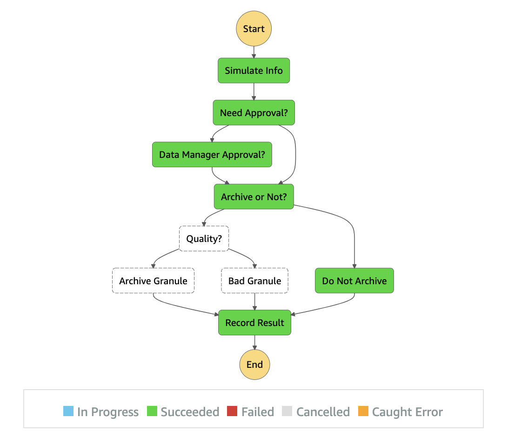

# overview

<p align="center">
  
</p>

This is a prototype of generic data archive capabilities to evaluate AWS SAM(with stepfunctions).
Very borrowed from stock tracker example

prereqs
- aws cli
- SAM cli

features
- simulated file metadata
- 2 levels of choice (archive, quality)
- input param for human interaction
- empty action lambdas
- results recorded in dynamodb

TODO
- trigger on s3 file drop
- act on human response (callback success/fail and data)
- actually act on file (move/remove/scan/etc)
- express workflows

important points
- most results are less about SAM, more about step functions or cloudformation
- SAM is mostly just cloudformation + step functions + lambdas...

The GOOD</br>
[NRSAM = not really SAM feature, e.g. step functions]
- [NRSAM] AMAZING graph inspector (AWS->Step Functions->StateMachines)
- offers change config deployment of services
- just deploys changes to config
- [NRSAM] Statefunctions: Offers variable mapping incoming and outgoing

The Bad
- stack config errors often appear in deploy (vs earlier in verification)
- slow deploy for dev (maybe use localstack or "step functions local")
- not sure how to test StateMachine operators (localstack? lambdas testable in js/python/...)
- autogenerated tables clear every deploy? (hardcode in .cf for prod)
- autogenerated stack name clears every deploy? (hardcode in .cf for prod)

The Meh
- really cloudformation under hood
- example uses AWS Serverless vs direct State Machine

refs
- SAM: https://docs.aws.amazon.com/serverless-application-model/latest/developerguide/sam-resource-statemachine.html
- Step Functions: States: https://docs.aws.amazon.com/step-functions/latest/dg/concepts-states.html
- Step Functions: https://aws-step-functions-data-science-sdk.readthedocs.io/en/stable/steps.html
- Manipulate message en-route: https://docs.aws.amazon.com/step-functions/latest/dg/input-output-inputpath-params.html

# to use

## basics

build
```
sam build
sam deploy
# OR
sam deploy --guided
```

setup vars for interaction
```
# HIGHLY presumptuous, should be true if you just deployed fresh
tn=`aws dynamodb list-tables | jq -r '.TableNames|.[]|select(match(".*ArchiveTable.*"))'|head -1`
sf=`aws stepfunctions list-state-machines | jq -r '.stateMachines|.[]|select(.stateMachineArn|match(".*ArchiverStateMachine.*"))|.stateMachineArn'`
echo $tn
echo $sf
qu=`aws sqs list-queues | jq -r '.QueueUrls|.[]' | grep 'HumanSQS' | head -1`
echo $qu
```

(optional) clear table if necessary
```
# slow but only other way is nasty delete/create
aws dynamodb scan --table-name "$tn" --max-items 1000 | tee moo.records   
cat moo.records | jq -r '.Items[].Id.S' \
    | xargs -I keyItem aws dynamodb delete-item --table-name "$tn" --key='{"Id":{"S":"keyItem"}}'
```
```
aws dynamodb scan --table-name $tn
```

## run (normal pre human interaction [neanderthal])
```
aws stepfunctions start-execution --state-machine-arn $sf
seq 10 | xargs -I moo aws stepfunctions start-execution --state-machine-arn $sf
```
```
aws dynamodb scan --table-name $tn \
    | jq -r '.Items|.[]|(.Timestamp.S+"\t"+(.Archive.BOOL|tostring)+"\t"
    +.Quality.N+"\t"+.Action.S+"\t"+(.Approval.BOOL|tostring))' \
    | sed 's/true*$/HUMAN/;s/false*$/inhuman/' \
    | sed 's/Z\ttrue/Z\tArchive/;s/Z\tfalse/Z\tnon_archive/' \
    | column -t | sort -r
2021-04-22T16:29:18.327Z  Archive      35  Quality_Fail  HUMAN
2021-04-22T16:15:53.117Z  non_archive  76  Unarchivable  inhuman
2021-04-22T16:15:52.381Z  Archive      4   Quality_Fail  inhuman
2021-04-22T16:15:51.863Z  Archive      82  Archived      inhuman
```
see (CloudWatch -> Logs -> Log groups) for events on statefunctions, lambdas, ?

## cool ui

debugging stepfunctions and lambdas in AWS console is amazing

- AWS -> Step Functions -> State Machines -> [machine] -> [exectution]
- AWS -> Cloud Watch -> Lambda
- AWS -> Lambda -> Functions -> [function] -> Monitor


## manual/human interaction
kick off (does not use response here)
```
aws stepfunctions start-execution --state-machine-arn $sf --input '{"approval_needed":true}'
```
get token and message handle
```
aws sqs receive-message --queue-url $qu | tee moo.sqs.msg
tt=`cat moo.sqs.msg| jq -r '.Messages[0].Body' | jq -r '.TaskToken'`
echo $tt
rh=`cat moo.sqs.msg| jq -r '.Messages[0].ReceiptHandle'`
echo $rh
```
manually send success callback (and delete message from queue)
```
aws stepfunctions send-task-success --task-token "$tt" --task-output '{"approved":false}'
# OR
# aws stepfunctions send-task-success --task-token "$tt" --task-output '{"approved":true}'
aws sqs delete-message --queue-url $qu --receipt-handle $rh
```

## optionally delete existing records
sometimes on SAM changes new table not generated
```
aws dynamodb scan --table-name "$tn" --max-items 1000 | tee moo.records   
cat moo.records | jq -r '.Items[].Id.S' \
    | xargs -I keyItem aws dynamodb delete-item \
      --table-name "$tn" --key='{"Id":{"S":"keyItem"}}'
```

# human interaction details

## SQS to whatever

uses sqs waitForTaskToken
```"Resource": "arn:aws:states:::sqs:sendMessage.waitForTaskToken"```
- send token via SQS (could send any number of ways)
- manually invoke callback (SendTaskSuccess or SendTaskFailure)

```
aws sqs receive-message --queue-url $qu > moo.sqs.msg
tt=`cat moo.sqs.msg| jq -r '.Messages[0].Body' | jq -r '.TaskToken'`
echo $tt
aws stepfunctions send-task-success --task-token "$tt" --task-output 'approve me!'
aws sqs delete-message --queue-url $qu --receipt-handle $rh
```

## email w/ API Gateway

very cool example that emails a link for approval (or denial)</br>
uses lambda waitForTaskToken
- https://docs.aws.amazon.com/step-functions/latest/dg/tutorial-human-approval.html#human-approval-yaml

# troubleshooting

## in ROLLBACK_COMPLETE state and can not be updated
```Error: Failed to create changeset for the stack: ncap-lv-step-test-sam, An error occurred (ValidationError) when calling the CreateChangeSet operation: Stack:arn:aws:cloudformation:us-east-2:633311497993:stack/ncap-lv-step-test-sam/b19114c0-a082-11eb-92ad-020cb91688de is in ROLLBACK_COMPLETE state and can not be updated.```

delete stuck one
```
sn=`cat samconfig.toml | grep stack_name | sed 's/.*= //' | tr -d '"'`
echo $sn
aws cloudformation delete-stack --stack-name $sn
```
